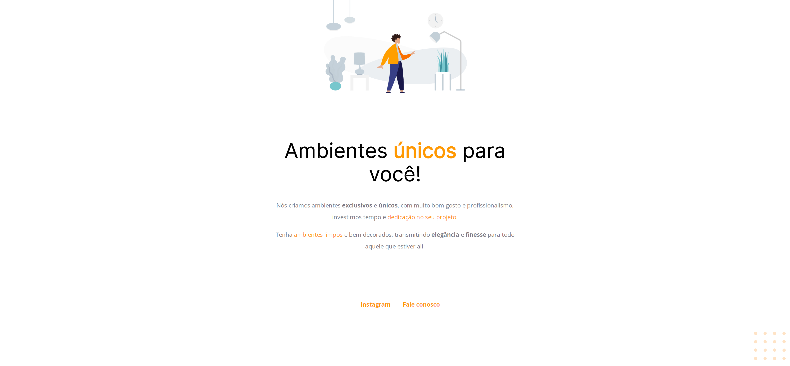

# Projeto 1 - Stage 2

### 🚀 Trilha Explorer Rocketseat 

Acesse o link do projeto em *About*

### 📌 Tecnologias
- HTML

- CSS

### 📚 Meu aprendizado
Através da aulas do Stage 02 do curso Explorer da Rocketseat, adquiri conhecimentos sobre posicionamento de elementos na página do HTML e propriedades no CSS.

### 👩‍💻 Contato
https://www.linkedin.com/in/palomabecker/

e-mail: palomabeckers@hotmail.com
